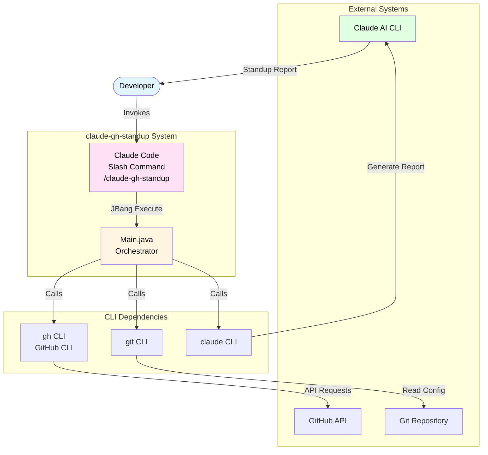

# System Overview

This document provides a high-level overview of the claude-gh-standup system architecture.

## System Context

## Key Characteristics

### Zero API Key Management
- **No GitHub API Keys**: Uses authenticated `gh` CLI
- **No Anthropic API Keys**: Uses `claude -p` (prompt mode)
- **Seamless Integration**: Leverages existing CLI authentication

### Repository-Aware
- Auto-detects current git repository
- Filters activity to the active project context
- Falls back to all repositories if not in a git repo

### Single-File Executables
- Built with JBang for zero-setup deployment
- Each component is a standalone `.java` file with shebang
- Dependencies declared inline with `//DEPS` comments

### Streaming Output
- Uses `ProcessBuilder.inheritIO()` for direct output piping
- Claude responses stream directly to user's terminal
- No intermediate buffering or storage required

## Technology Stack

| Layer | Technology | Purpose |
|-------|-----------|---------|
| **Runtime** | JBang | Single-file Java script execution |
| **Language** | Java 11+ | Cross-platform compatibility |
| **CLI Integration** | ProcessBuilder | External tool invocation |
| **JSON Processing** | Gson 2.10.1 | GitHub API response parsing |
| **Git Operations** | git CLI | Repository detection |
| **GitHub Data** | gh CLI | Activity collection |
| **AI Generation** | claude CLI | Report generation |

## System Boundaries

### What the System Does
- Collects GitHub activity (commits, PRs, issues, reviews)
- Analyzes file changes from PR diffs
- Generates natural language standup reports
- Supports team aggregation
- Exports to multiple formats

### What the System Does NOT Do
- Does not store data persistently
- Does not require network APIs directly
- Does not manage authentication
- Does not modify GitHub data
- Does not cache results

## Integration Points

### Input
- Command-line arguments (days, user, repo, format, team, output)
- Git repository configuration (remote URL)
- GitHub CLI authentication state

### Output
- Formatted standup reports (Markdown/JSON/HTML)
- Console output (stdout/stderr)
- Optional file export

### External Dependencies
- GitHub CLI (`gh`) - must be authenticated
- Git CLI (`git`) - for repository detection
- Claude CLI (`claude`) - for AI generation
- JBang - for script execution
- Java 11+ - managed by JBang
