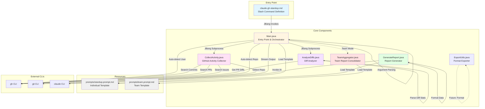
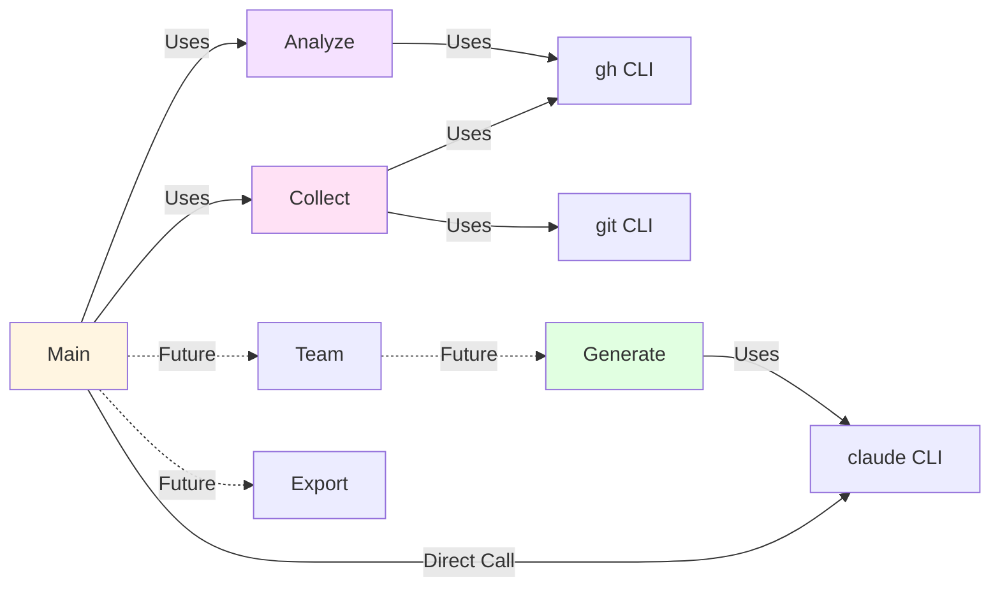

# Component Architecture

This document describes the internal component structure of claude-gh-standup.

## Component Diagram



## Component Descriptions

### Main.java
**Purpose**: Entry point and workflow orchestrator

**Responsibilities**:
- Parse command-line arguments (`--days`, `--user`, `--repo`, `--format`, `--team`, `--output`)
- Auto-detect current git repository
- Auto-detect authenticated GitHub user
- Orchestrate workflow: collect → analyze → generate
- Handle single-user vs. team modes
- Direct invocation of Claude CLI (using `inheritIO()` pattern)

**Key Methods**:
- `parseArgs()` - Command-line argument parser
- `getCurrentRepository()` - Git repository detection
- `getCurrentUser()` - GitHub user detection via `gh api user`
- `formatActivities()` - Convert JSON to readable format
- `runScript()` - JBang subprocess executor

**Dependencies**:
- Gson for JSON parsing
- ProcessBuilder for subprocess execution
- Java NIO for file I/O

### CollectActivity.java
**Purpose**: GitHub activity data collection

**Responsibilities**:
- Search for user commits via `gh search commits`
- Search for user PRs via `gh search prs`
- Search for user issues via `gh search issues`
- Apply date range filters (last N days)
- Apply repository filters (optional)
- Auto-detect repository context
- Consolidate results into JSON structure

**Output Format**:
```json
{
  "username": "octocat",
  "days": 7,
  "repository": "owner/repo",
  "commits": [...],
  "pull_requests": [...],
  "issues": [...]
}
```

**Key Methods**:
- `getUserCommits()` - Fetch commits via gh CLI
- `getUserPRs()` - Fetch pull requests
- `getUserIssues()` - Fetch issues
- `collectAllActivity()` - Aggregate all activity types
- `getCurrentRepository()` - Detect git repo

### AnalyzeDiffs.java
**Purpose**: File change analysis for PRs

**Responsibilities**:
- Fetch PR diffs via `gh pr diff`
- Parse unified diff format
- Calculate file-level statistics (additions, deletions)
- Aggregate changes across all PRs
- Format summary for AI context

**Output Format**:
```
Files changed: 12
Lines added: 245
Lines deleted: 89

Modified files:
- src/Main.java (+45, -12)
- src/CollectActivity.java (+89, -23)
- README.md (+111, -54)
```

**Key Methods**:
- `analyzePRDiff()` - Fetch diff for single PR
- `parseDiff()` - Parse unified diff format
- `analyzePRDiffs()` - Aggregate multiple PR diffs
- `formatDiffSummary()` - Create readable summary

**Data Structures**:
- `FileStat` - Per-file change statistics
- `DiffSummary` - Aggregated change summary

### GenerateReport.java
**Purpose**: AI-powered report generation

**Responsibilities**:
- Load prompt template from file
- Format activity JSON into readable text
- Inject data into template placeholders
- Invoke Claude CLI with full prompt
- Stream output directly to stdout

**Template Variables**:
- `{{activities}}` - Formatted commit/PR/issue list
- `{{diffs}}` - File change summary

**Key Methods**:
- `loadPromptTemplate()` - Read template file
- `formatActivities()` - Convert JSON to text
- `generateStandupReport()` - Full workflow
- ProcessBuilder with `inheritIO()` for streaming

**Notable Pattern**:
```java
ProcessBuilder pb = new ProcessBuilder("claude", "-p", fullPrompt);
pb.inheritIO();  // Stream directly to stdout
Process process = pb.start();
```

### ExportUtils.java
**Purpose**: Format conversion (Markdown/JSON/HTML)

**Status**: Placeholder for future export functionality

**Planned Responsibilities**:
- Convert Markdown to JSON
- Convert Markdown to HTML
- Write to output files
- Handle different format specifications

### TeamAggregator.java
**Purpose**: Multi-user report consolidation

**Status**: Placeholder for team mode functionality

**Planned Responsibilities**:
- Collect individual reports for team members
- Consolidate into team standup format
- Use team-specific prompt template
- Generate aggregated insights

## Prompt Templates

### standup.prompt.md
Individual developer standup report template

**Structure**:
- System instructions for AI
- Output format guidelines (Yesterday/Today/Blockers)
- Context about file changes
- Template placeholders for data injection

### team.prompt.md
Team aggregation template (future)

**Purpose**: Generate team-level insights from individual reports

## Design Patterns

### JBang Single-File Executables
Each component is a standalone executable:
```java
///usr/bin/env jbang "$0" "$@" ; exit $?
//DEPS com.google.code.gson:gson:2.10.1
```

### ProcessBuilder Pattern
Consistent external tool invocation:
```java
ProcessBuilder pb = new ProcessBuilder("gh", "search", "commits", ...);
Process process = pb.start();
// Read output, check exit code
```

### inheritIO Streaming Pattern
Direct output piping (tac-1 pattern):
```java
ProcessBuilder claudeBuilder = new ProcessBuilder("claude", "-p", fullPrompt);
claudeBuilder.inheritIO();  // No buffering
Process claudeProcess = claudeBuilder.start();
```

### Template-Based Prompt Engineering
Separation of concerns:
- Logic in Java
- AI instructions in Markdown templates
- Data injection via simple string replacement

## Component Dependencies



## Error Handling Strategy

### Graceful Degradation
- Commit search fails → Continue with PRs and issues
- PR diff unavailable → Skip that PR
- Repository not detected → Search across all repos

### User-Friendly Warnings
```
Warning: Commit search failed (this is common due to GitHub restrictions)
Warning: Not in a git repository or no GitHub remote found.
```

### Exit Codes
- `0` - Success
- `1` - Invalid arguments or execution failure
- Propagates subprocess exit codes

## Data Flow Summary

1. **Main.java** receives arguments and detects context
2. **CollectActivity.java** gathers GitHub data → JSON
3. **AnalyzeDiffs.java** analyzes PR diffs → Summary text
4. **Main.java** loads template, injects data
5. **claude CLI** generates report → stdout
6. User sees formatted standup report
