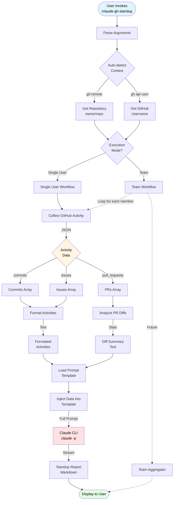
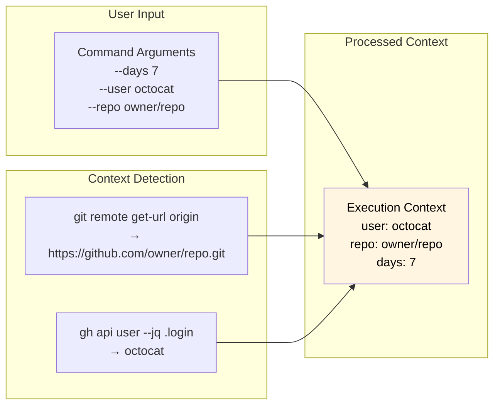
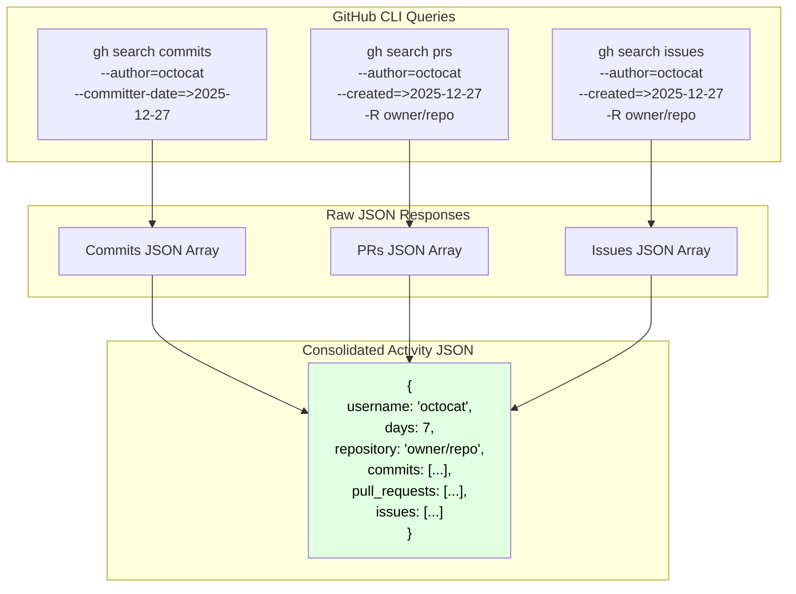
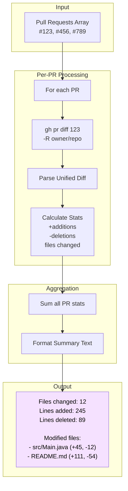
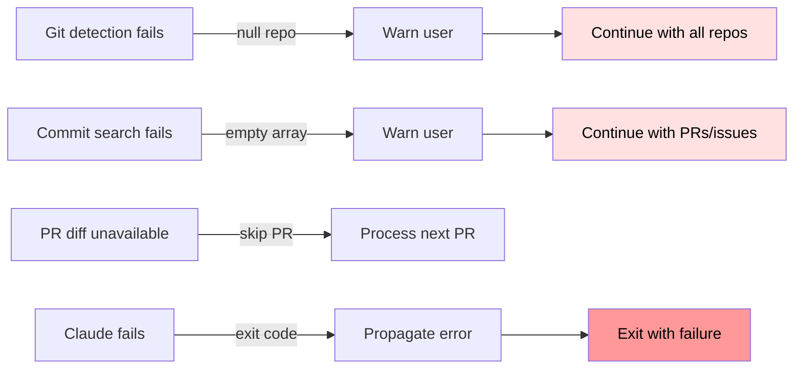

# Data Flow Architecture

This document describes how data flows through the claude-gh-standup system from user input to final output.

## End-to-End Data Flow



## Data Transformation Pipeline

### Stage 1: Input Processing



### Stage 2: Activity Collection



### Stage 3: Diff Analysis



### Stage 4: Report Generation

```mermaid
graph TB
    subgraph "Inputs"
        Activity[Formatted Activities<br/>Text]
        Diffs[Diff Summary<br/>Text]
        Template[Prompt Template<br/>prompts/standup.prompt.md]
    end

    subgraph "Template Processing"
        Load[Load Template File]
        Replace1[Replace '{{activities}}'<br/>with formatted activities]
        Replace2[Replace '{{diffs}}'<br/>with diff summary]
        FullPrompt[Complete Prompt]
    end

    subgraph "AI Generation"
        Claude[claude -p &lt;prompt&gt;]
        Stream[Stream Output<br/>via inheritIO]
    end

    subgraph "Output"
        Report[Standup Report<br/>Markdown]
    end

    Template --> Load
    Load --> Replace1
    Activity --> Replace1
    Replace1 --> Replace2
    Diffs --> Replace2
    Replace2 --> FullPrompt
    FullPrompt --> Claude
    Claude --> Stream
    Stream --> Report

    style Report fill:#e1ffe1,color:#000
```

## Data Formats

### Activity JSON Structure

```json
{
  "username": "octocat",
  "days": 7,
  "repository": "owner/repo",
  "commits": [
    {
      "sha": "abc123...",
      "commit": {
        "message": "Add feature X",
        "author": {...},
        "committer": {...}
      },
      "repository": {
        "fullName": "owner/repo"
      }
    }
  ],
  "pull_requests": [
    {
      "number": 123,
      "title": "Add feature Y",
      "state": "OPEN",
      "url": "https://github.com/owner/repo/pull/123",
      "repository": {
        "fullName": "owner/repo"
      }
    }
  ],
  "issues": [
    {
      "number": 456,
      "title": "Fix bug Z",
      "state": "CLOSED",
      "url": "https://github.com/owner/repo/issues/456",
      "repository": {
        "fullName": "owner/repo"
      }
    }
  ]
}
```

### Formatted Activities Text

```
COMMITS:
- [owner/repo] Add feature X (abc123)
- [owner/repo] Update documentation (def456)

PULL REQUESTS:
- [owner/repo] #123: Add feature Y (OPEN)
- [owner/repo] #124: Fix bug in auth (MERGED)

ISSUES:
- [owner/repo] #456: Fix bug Z (CLOSED)
```

### Diff Summary Text

```
Files changed: 12
Lines added: 245
Lines deleted: 89

Modified files:
- src/Main.java (+45, -12)
- src/CollectActivity.java (+89, -23)
- README.md (+111, -54)
- src/AnalyzeDiffs.java (+0, -0)
```

### Final Prompt Structure

```markdown
# Standup Report Generator

You are an AI assistant helping to generate professional standup reports...

## Activity Data

COMMITS:
- [owner/repo] Add feature X (abc123)

PULL REQUESTS:
- [owner/repo] #123: Add feature Y (OPEN)

## File Changes

Files changed: 12
Lines added: 245
Lines deleted: 89

Modified files:
- src/Main.java (+45, -12)
```

### Output Report Format

```markdown
**Yesterday's Accomplishments**
- Implemented feature X for the authentication module
- Opened PR #123 to add feature Y with 245 lines of new code
- Closed issue #456 related to bug Z

**Today's Plans**
- Review and address feedback on PR #123
- Continue work on feature X implementation
- Begin investigating performance optimization

**Blockers**
- None at this time
```

## Data Flow Characteristics

### Streaming vs. Buffering

| Stage | Strategy | Reason |
|-------|----------|--------|
| GitHub API calls | Buffered | Need complete JSON for parsing |
| Diff analysis | Buffered | Need complete diff for stats |
| Claude output | **Streamed** | Real-time user feedback |

### Error Propagation



### Memory Efficiency

- **No persistent storage**: All data is transient
- **Subprocess isolation**: Each JBang script runs in separate JVM
- **Streaming output**: Claude results go directly to stdout
- **JSON parsing**: Only in-memory, no file I/O

### Parallelization Opportunities

Current: **Sequential execution**
```
Collect → Analyze → Generate
```

Future potential:
```
Collect (parallel: commits + PRs + issues)
  ↓
Analyze (parallel: PR diffs)
  ↓
Generate (streaming)
```

## Data Validation

### Input Validation
- `--days`: Must be valid integer
- `--user`: String (no validation)
- `--repo`: Format `owner/repo` (no validation)
- `--format`: Enum validation (future)

### Output Validation
- GitHub CLI exit codes checked
- JSON parsing exceptions caught
- Claude exit code checked
- No output content validation

### Data Sanitization
- No SQL injection (no database)
- No XSS (no HTML in current impl)
- Shell injection protected by ProcessBuilder array API
- JSON escaping handled by Gson
