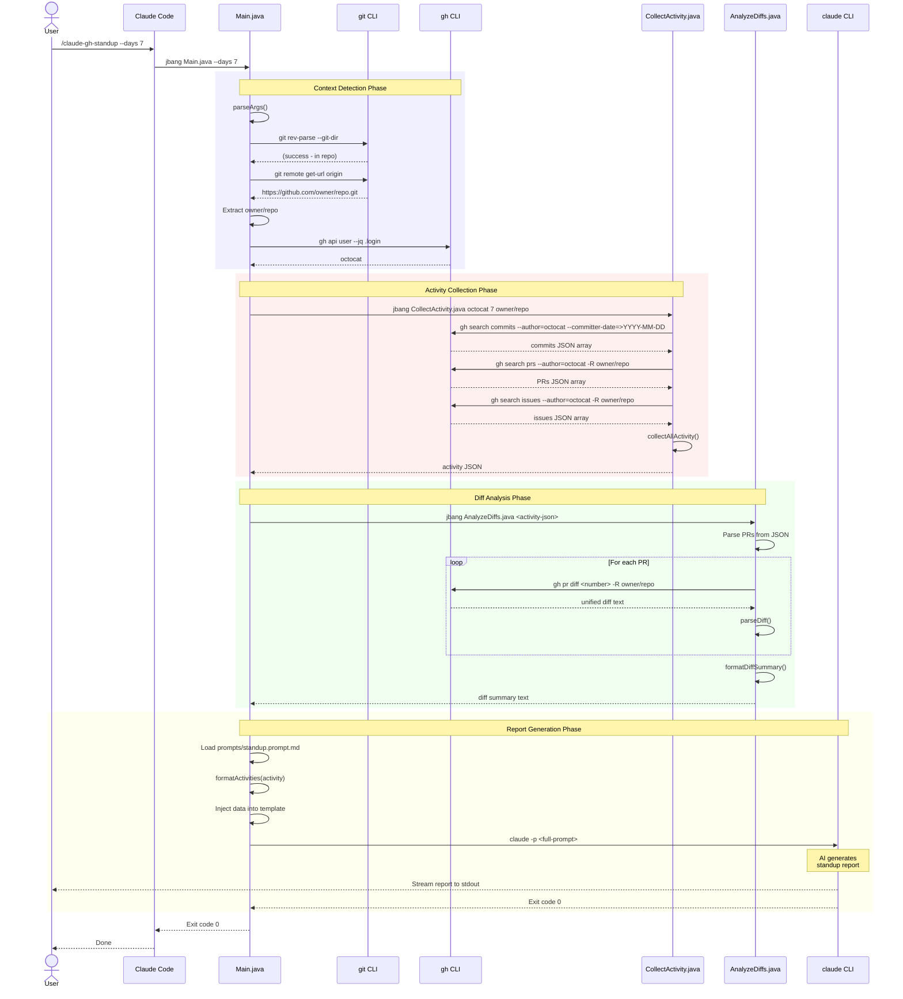
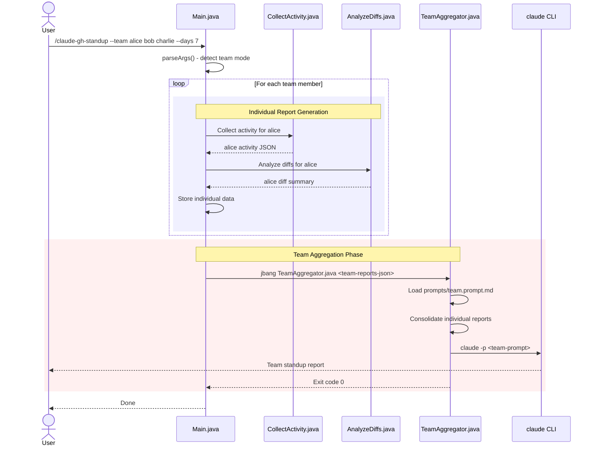
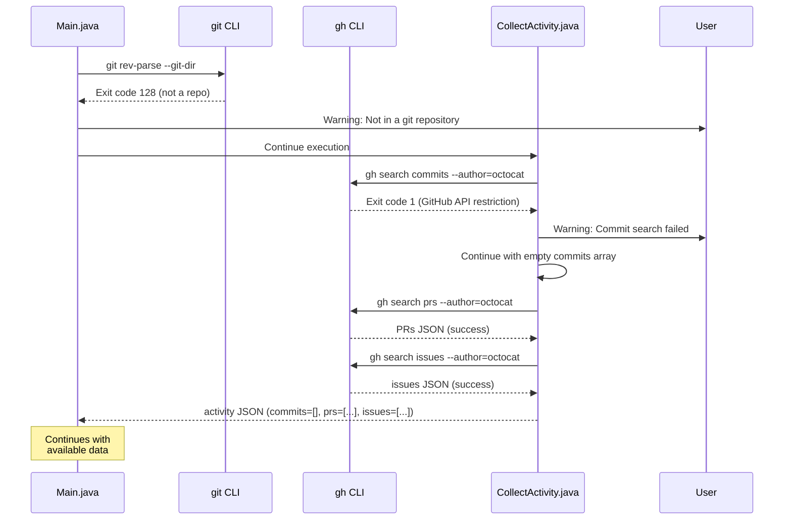
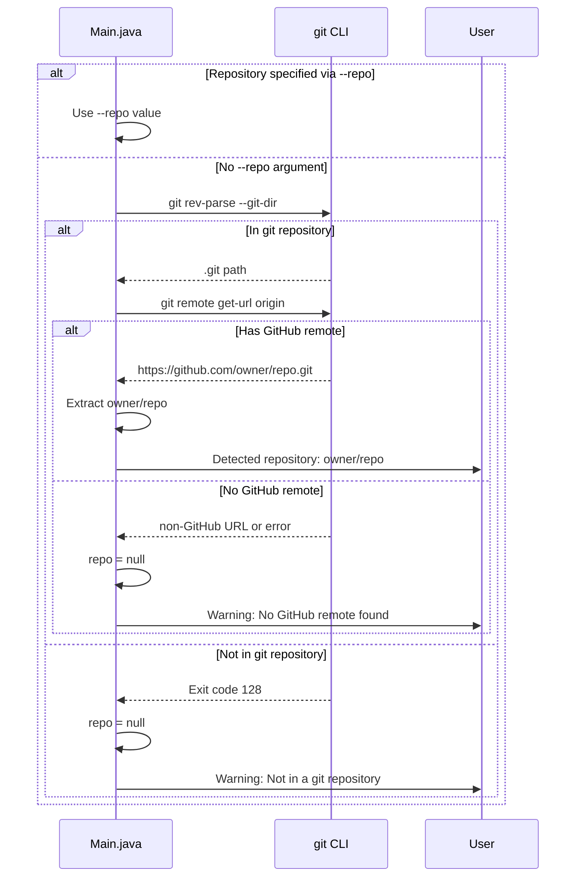
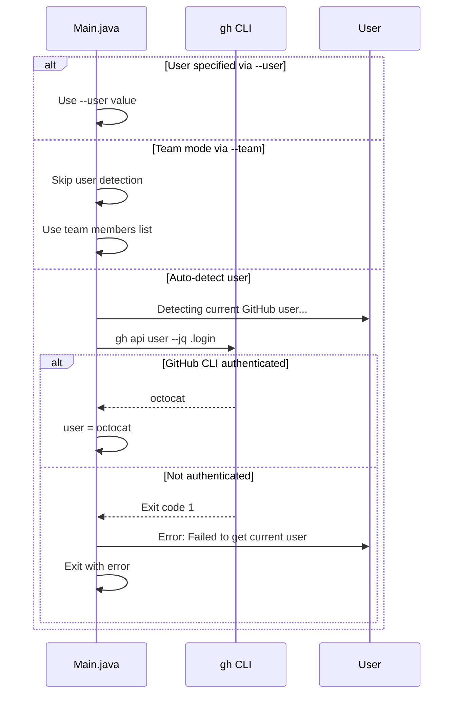
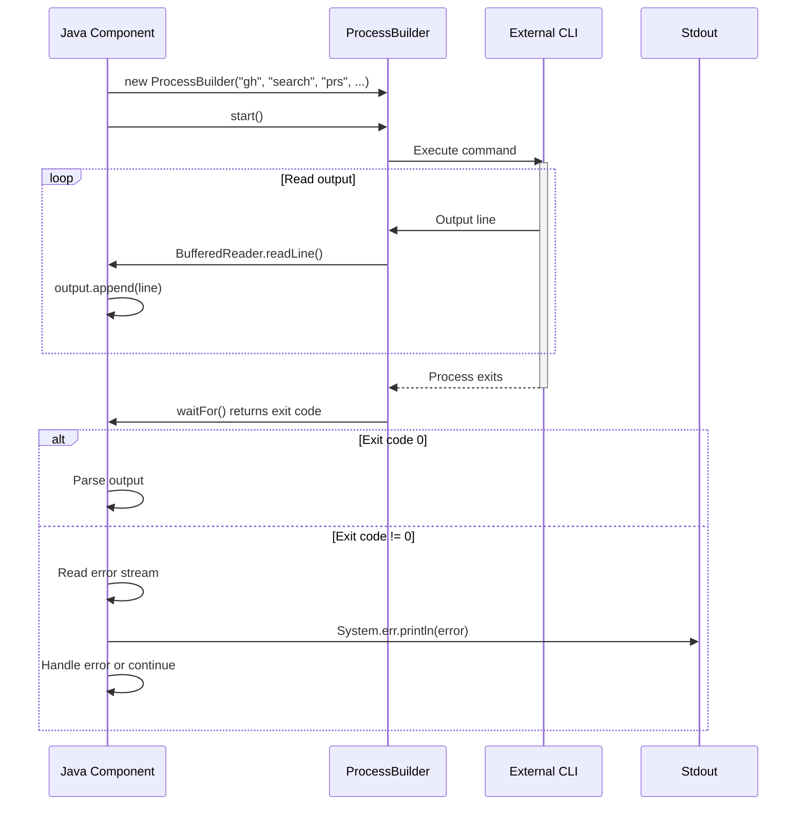
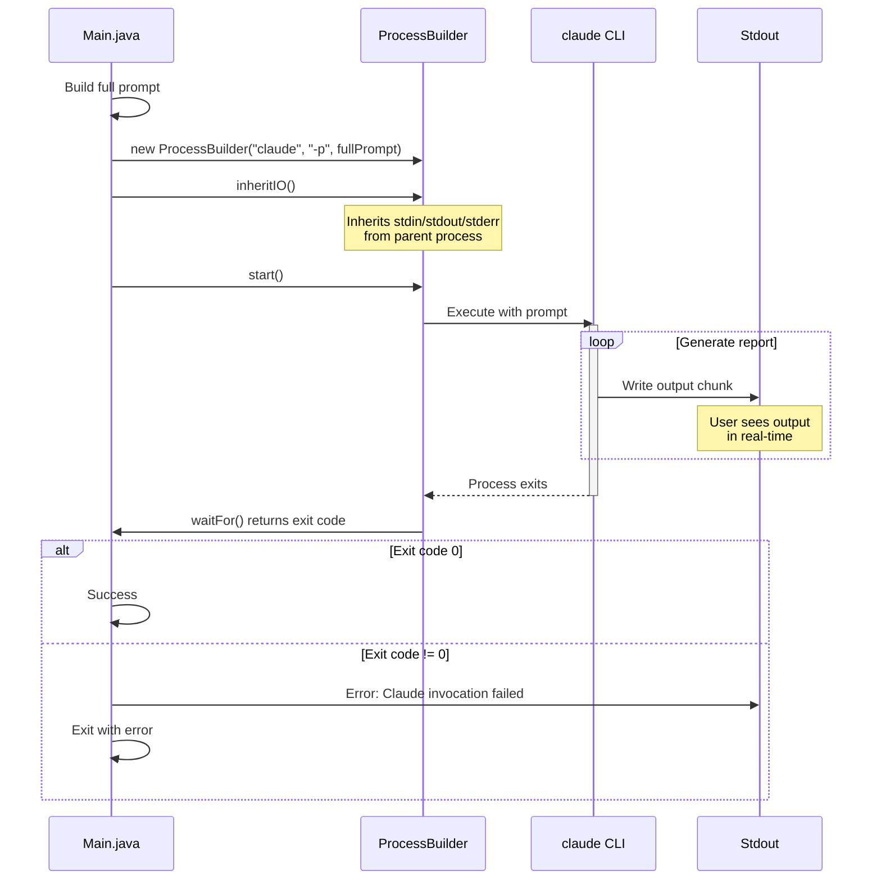

# Sequence Diagrams

This document shows the temporal flow of interactions in claude-gh-standup.

## Single User Standup Flow

## Team Standup Flow (Future)

## Error Handling Flow

## Repository Detection Flow

## User Detection Flow

## ProcessBuilder Invocation Pattern

## Claude Streaming Pattern (inheritIO)

## Timing Characteristics

### Typical Execution Timeline

```mermaid
gantt
    title Single User Standup Generation Timeline
    dateFormat X
    axisFormat %S

    section Context Detection
    Parse args           :0, 1
    Detect repository    :1, 2
    Detect user          :2, 3

    section Activity Collection
    Search commits       :3, 6
    Search PRs           :6, 8
    Search issues        :8, 10

    section Diff Analysis
    Fetch PR diffs       :10, 15
    Parse diffs          :15, 16

    section AI Generation
    Load template        :16, 17
    Format data          :17, 18
    Claude generation    :18, 30

    section Output
    Stream to user       :18, 30
```

**Approximate timings**:
- Context detection: ~1-2 seconds
- Activity collection: ~5-7 seconds (varies by GitHub API)
- Diff analysis: ~4-6 seconds (varies by number of PRs)
- AI generation: ~10-15 seconds (varies by prompt size and Claude load)

**Total**: ~20-30 seconds for typical single-user standup

### Performance Bottlenecks

1. **GitHub API calls** - Sequential, network-dependent
2. **PR diff fetching** - One API call per PR
3. **Claude generation** - LLM inference time

### Future Optimization Opportunities

- Parallel GitHub API calls (commits + PRs + issues)
- Parallel PR diff fetching
- Caching of recent activity data
- Batch PR diff requests
