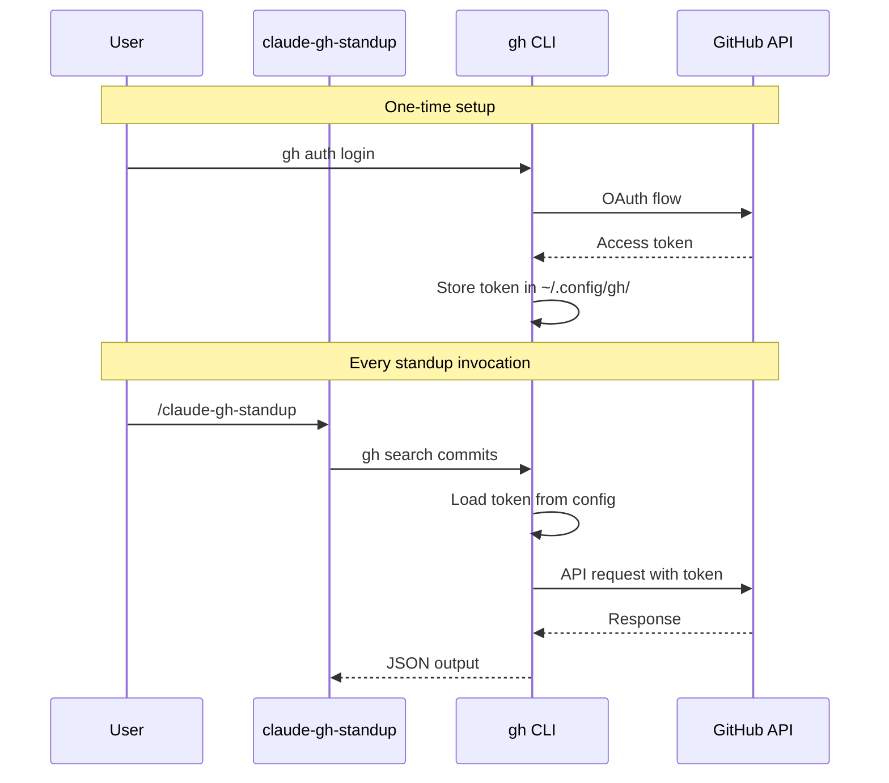
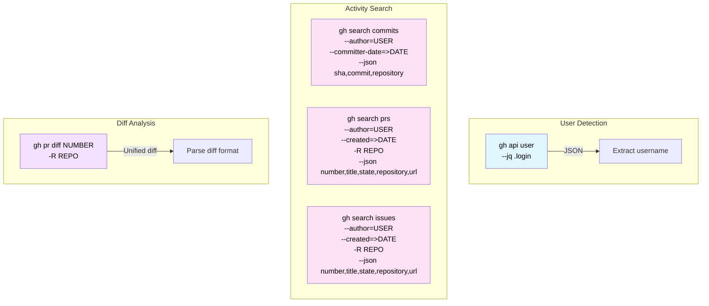
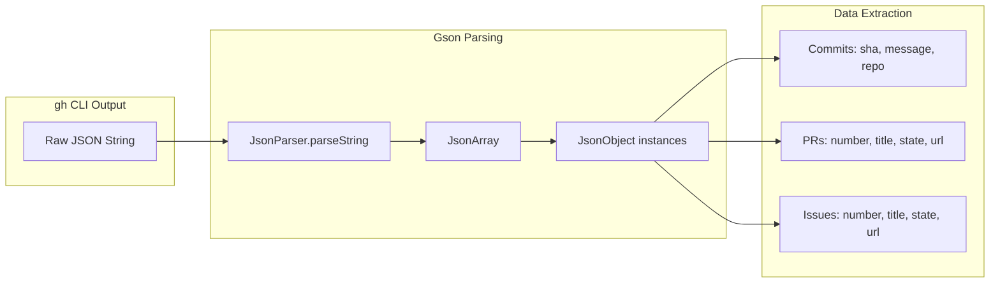
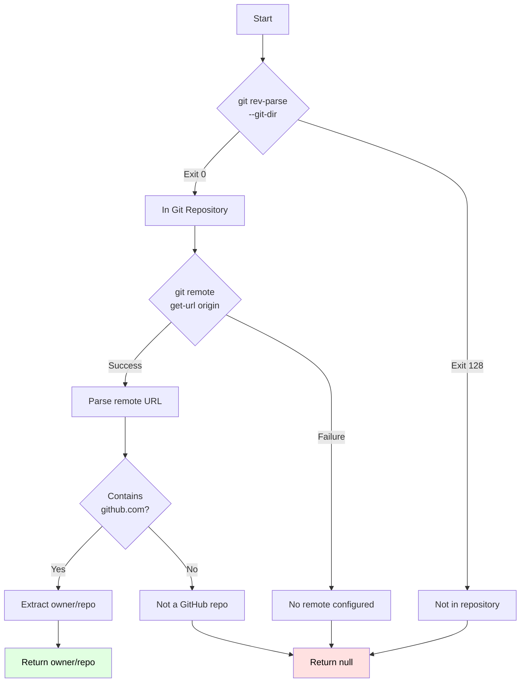
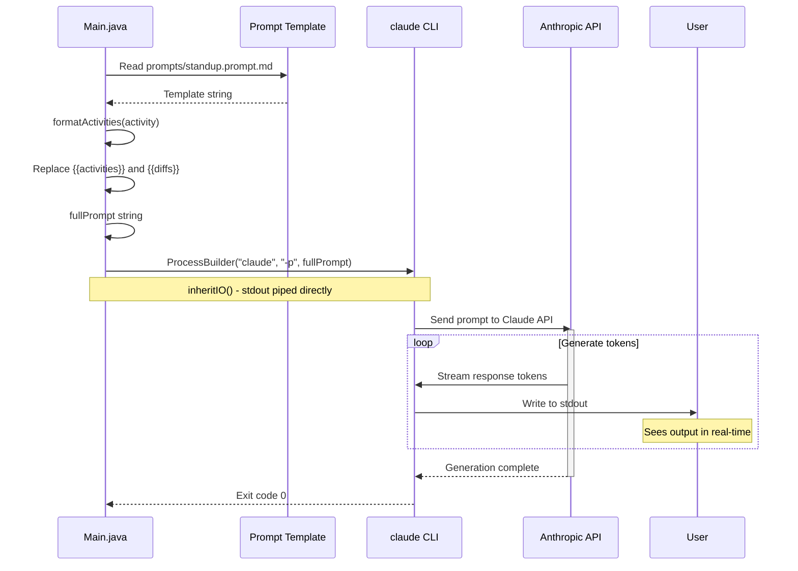
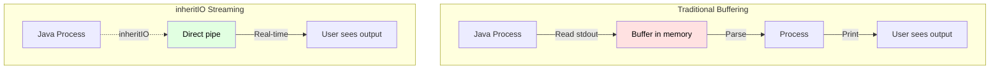
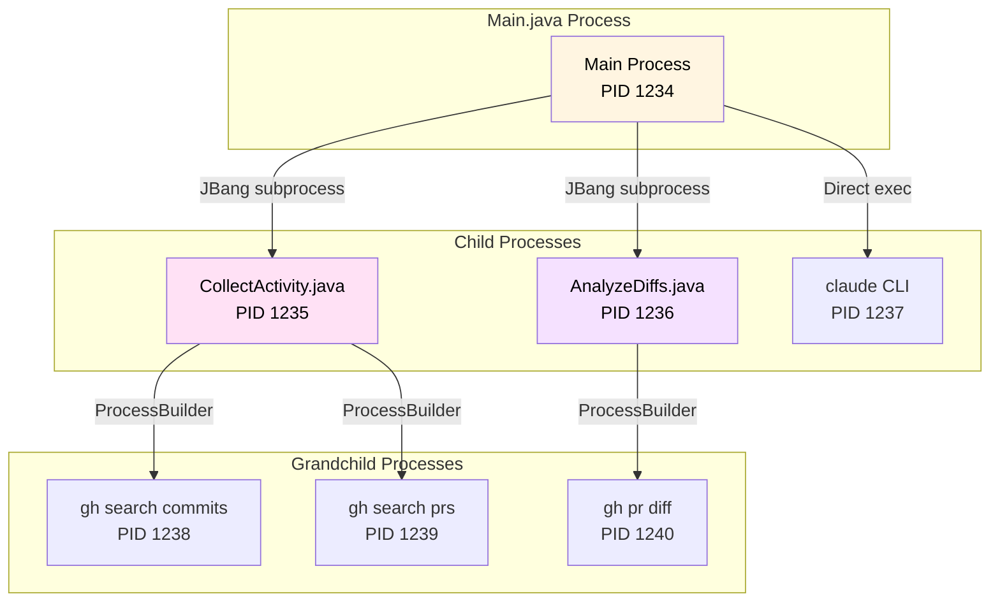
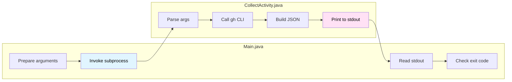
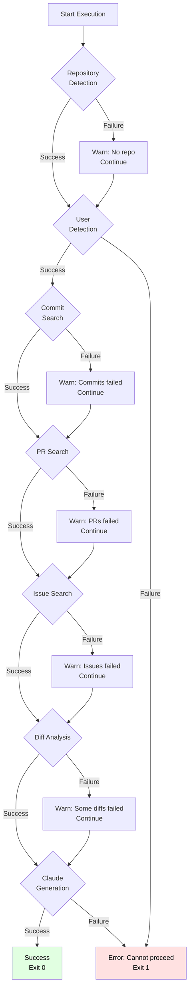
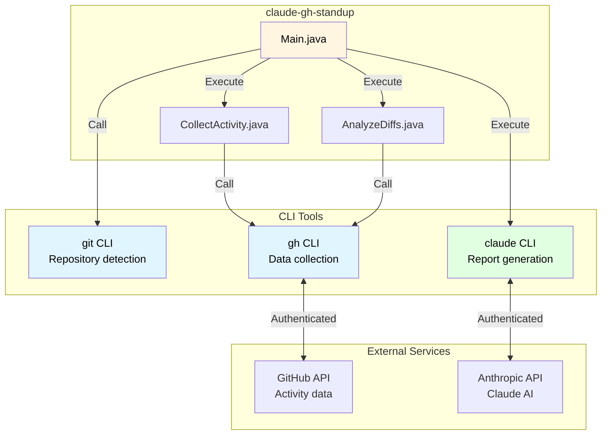

# Integration Patterns

This document details how claude-gh-standup integrates with external systems.

## GitHub CLI Integration

### Authentication Flow



**Key Benefits**:
- No API key management in code
- Leverages existing gh CLI authentication
- Token refresh handled by gh CLI
- Supports GitHub Enterprise via gh CLI config

### GitHub CLI Commands Used



### Search Query Construction

#### Commits Search
```java
// Command construction
gh search commits
  --author=octocat
  --committer-date=>2025-12-27
  --json sha,commit,repository
  --limit 1000
```

**Limitations**:
- Often fails due to GitHub API restrictions
- Not all commits are indexed for search
- System continues gracefully if this fails

#### Pull Requests Search
```java
// With repository filter
gh search prs
  --author=octocat
  --created=>2025-12-27
  -R owner/repo
  --json number,title,state,repository,url
  --limit 1000

// Without repository filter (all repos)
gh search prs
  --author=octocat
  --created=>2025-12-27
  --json number,title,state,repository,url
  --limit 1000
```

#### Issues Search
```java
// Same pattern as PRs
gh search issues
  --author=octocat
  --created=>2025-12-27
  -R owner/repo
  --json number,title,state,repository,url
  --limit 1000
```

### JSON Response Parsing



**Example commit JSON**:
```json
{
  "sha": "abc123def456...",
  "commit": {
    "message": "Add feature X\n\nDetailed description...",
    "author": {
      "name": "Alice Developer",
      "email": "alice@example.com"
    }
  },
  "repository": {
    "fullName": "owner/repo"
  }
}
```

## Git CLI Integration

### Repository Detection



### URL Parsing Logic

```java
// Supports multiple GitHub URL formats
String remoteUrl = "https://github.com/owner/repo.git";
// OR
String remoteUrl = "git@github.com:owner/repo.git";

// Regex pattern
if (remoteUrl.contains("github.com")) {
    String[] parts = remoteUrl.split("github.com[:/]");
    if (parts.length > 1) {
        String repoPath = parts[1].replaceAll("\\.git$", "");
        return repoPath; // "owner/repo"
    }
}
```

**Supported formats**:
- `https://github.com/owner/repo.git`
- `https://github.com/owner/repo`
- `git@github.com:owner/repo.git`
- `git@github.com:owner/repo`

## Claude CLI Integration

### Prompt Mode Invocation



### Template Injection Pattern

```java
// Load template file
String promptTemplate = Files.readString(
    Paths.get("prompts/standup.prompt.md")
);

// Format activity data
String formattedActivities = formatActivities(activity);

// Inject data via string replacement
String fullPrompt = promptTemplate
    .replace("{{activities}}", formattedActivities)
    .replace("{{diffs}}", diffSummary);

// Invoke Claude
ProcessBuilder pb = new ProcessBuilder("claude", "-p", fullPrompt);
pb.inheritIO();
Process process = pb.start();
```

**Template placeholders**:
- `{{activities}}` - Formatted commits, PRs, issues
- `{{diffs}}` - File change statistics and summary

### Streaming Output (inheritIO Pattern)



**Benefits of inheritIO**:
- User sees output as it's generated
- No memory buffering overhead
- Natural streaming experience
- No intermediate parsing required

**Trade-off**:
- Cannot capture output for post-processing
- Cannot modify or filter output
- Exit code is only feedback mechanism

### Error Handling

```java
int exitCode = claudeProcess.waitFor();

if (exitCode != 0) {
    System.err.println("Claude invocation failed with exit code: " + exitCode);
    System.exit(exitCode);
}
```

**Possible exit codes**:
- `0` - Success
- `1` - General error (invalid prompt, API error, etc.)
- Other - System errors

## JBang Process Orchestration

### Subprocess Execution Pattern



### JBang Subprocess Invocation

```java
// Build command
List<String> command = new ArrayList<>();
command.add("jbang");
command.add("scripts/CollectActivity.java");
command.add(username);
command.add(String.valueOf(days));
if (repo != null) {
    command.add(repo);
}

// Execute
ProcessBuilder pb = new ProcessBuilder(command);
Process process = pb.start();

// Read output
StringBuilder output = new StringBuilder();
try (BufferedReader reader = new BufferedReader(
        new InputStreamReader(process.getInputStream()))) {
    String line;
    while ((line = reader.readLine()) != null) {
        output.append(line).append("\n");
    }
}

// Wait and check
int exitCode = process.waitFor();
if (exitCode != 0) {
    // Handle error
}
```

### Process Communication



**Communication protocol**:
- **Input**: Command-line arguments
- **Output**: JSON to stdout
- **Errors**: Messages to stderr
- **Status**: Process exit code

## Error Handling Strategies

### Graceful Degradation



### Warning vs. Error Policy

**Warnings (continue execution)**:
- Repository not detected
- Commit search failed
- Individual PR diff unavailable

**Errors (stop execution)**:
- User detection failed
- Cannot read prompt template
- Claude invocation failed

### Example Error Messages

```java
// Repository detection warning
System.err.println("Warning: Not in a git repository or no GitHub remote found.");
System.err.println("Activity will be searched across all repositories.");
System.err.println("Use --repo owner/repo to specify a repository.");

// Commit search warning
System.err.println("Warning: Commit search failed (this is common due to GitHub restrictions)");

// PR diff warning
System.err.println("Warning: Could not analyze diff for PR #" + prNumber + ": " + e.getMessage());

// Claude failure error
System.err.println("Claude invocation failed with exit code: " + claudeExitCode);
System.exit(claudeExitCode);
```

## Integration Architecture Summary



**Key integration principles**:
1. **Delegate authentication** to CLI tools
2. **Use ProcessBuilder** for all external invocations
3. **Stream output** when possible (inheritIO)
4. **Parse JSON** only when needed
5. **Fail gracefully** on non-critical errors
6. **Propagate errors** from critical operations
