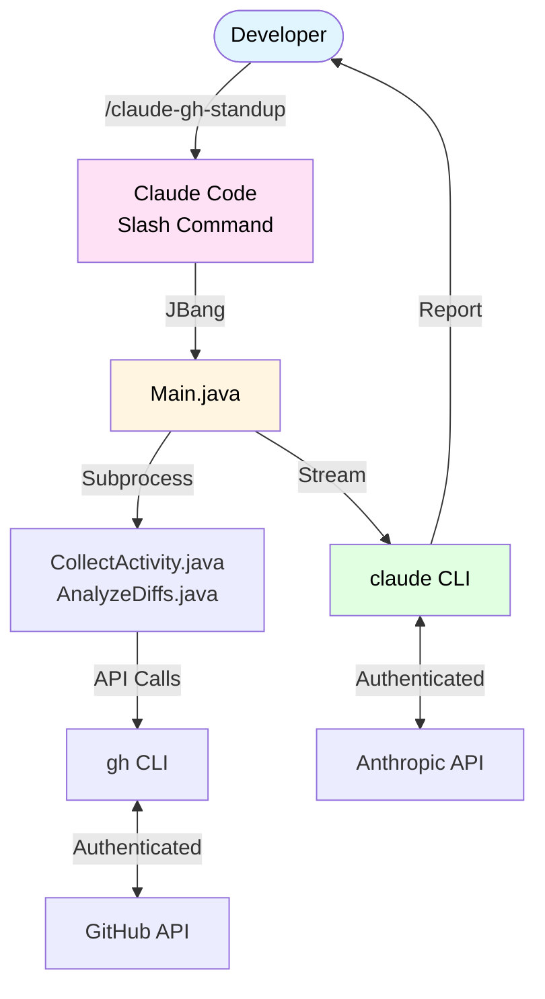
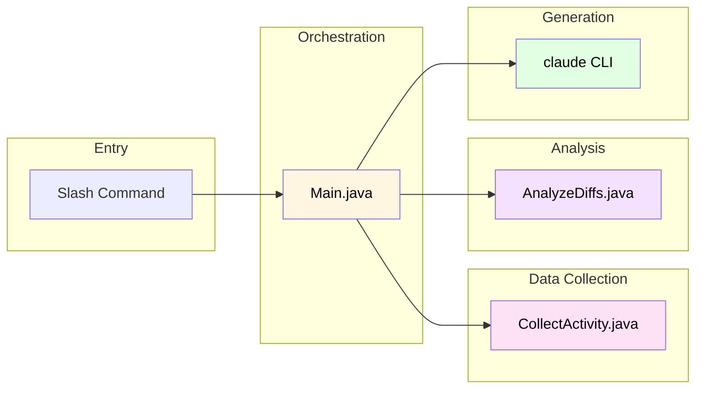

# Architecture Documentation

> Comprehensive architectural documentation for claude-gh-standup

This directory contains detailed architecture diagrams and documentation for the claude-gh-standup project, a JBang-based tool that generates AI-powered GitHub standup reports.

## Table of Contents

1. [System Overview](#system-overview)
2. [Component Architecture](#component-architecture)
3. [Data Flow](#data-flow)
4. [Sequence Diagrams](#sequence-diagrams)
5. [Integration Patterns](#integration-patterns)
6. [Quick Reference](#quick-reference)

## Documentation Structure

### 01-system-overview.md
**High-level system context and technology stack**

- System context diagram showing external dependencies
- Technology stack breakdown
- System boundaries and capabilities
- Integration points (input/output)
- Zero API key management approach

**Read this first** if you're new to the project.

### 02-component-architecture.md
**Internal component structure and design patterns**

- Component diagram showing all Java modules
- Detailed component descriptions with responsibilities
- Design patterns (JBang, ProcessBuilder, inheritIO)
- Component dependencies and relationships
- Error handling strategies

**Read this** to understand how the code is organized.

### 03-data-flow.md
**How data moves through the system**

- End-to-end data flow diagrams
- Stage-by-stage transformation pipeline
- Data format specifications (JSON, text, prompts)
- Memory efficiency and parallelization opportunities
- Data validation and sanitization

**Read this** to understand how data is processed.

### 04-sequence-diagrams.md
**Temporal flow of interactions**

- Single-user standup flow (complete sequence)
- Team standup flow (future)
- Error handling sequences
- Repository and user detection flows
- ProcessBuilder invocation patterns
- Claude streaming pattern with timings

**Read this** to understand the execution flow over time.

### 05-integration-patterns.md
**External system integration details**

- GitHub CLI integration (authentication, queries, parsing)
- Git CLI integration (repository detection)
- Claude CLI integration (prompt mode, streaming)
- JBang process orchestration
- Error handling strategies
- Integration architecture summary

**Read this** to understand how the system integrates with external tools.

## System Overview



## Key Architectural Decisions

### 1. JBang Single-File Executables

**Decision**: Use JBang for single-file Java scripts instead of traditional build tools

**Rationale**:
- Zero-setup deployment (no Maven/Gradle required)
- Each component is independently executable
- Dependencies declared inline with `//DEPS`
- Natural fit for CLI tools

**Trade-offs**:
- ✅ Easy distribution and installation
- ✅ No build step required
- ❌ Slower first execution (JBang cache)
- ❌ Limited to Java ecosystem

### 2. CLI Tool Orchestration vs. Direct APIs

**Decision**: Use `gh` CLI and `claude` CLI instead of GitHub/Anthropic SDKs

**Rationale**:
- Leverages existing authentication (no API key management)
- Simpler integration (ProcessBuilder vs. SDK complexity)
- Matches Claude Code's architecture philosophy
- Reduces dependencies

**Trade-offs**:
- ✅ No API key management code
- ✅ Simpler authentication flow
- ✅ Follows "tools over libraries" principle
- ❌ Depends on external CLI tools being installed
- ❌ Less control over requests

### 3. Streaming Output (inheritIO Pattern)

**Decision**: Stream Claude output directly to stdout using `ProcessBuilder.inheritIO()`

**Rationale**:
- Real-time user feedback
- No memory buffering overhead
- JBang + ProcessBuilder pattern for seamless integration
- Natural CLI experience

**Trade-offs**:
- ✅ User sees progress in real-time
- ✅ Lower memory footprint
- ❌ Cannot post-process Claude output
- ❌ Cannot implement export formats easily

### 4. Repository-Aware Context

**Decision**: Auto-detect git repository and filter activity by default

**Rationale**:
- More relevant standup reports
- Reduces noise from unrelated repositories
- Matches developer mental model (working in a repo)
- Can be overridden with `--repo` flag

**Trade-offs**:
- ✅ Better default behavior
- ✅ More contextual reports
- ❌ May miss activity if working across repos
- ❌ Requires git repository

### 5. JSON-Based Inter-Process Communication

**Decision**: Use JSON for communication between Java subprocesses

**Rationale**:
- Structured data format
- Gson library provides robust parsing
- Easy to debug and inspect
- Standard format for CLI tools

**Trade-offs**:
- ✅ Type-safe parsing
- ✅ Easy to extend
- ❌ Overhead of serialization/deserialization
- ❌ Must fit in memory

## Component Interaction Overview



## Execution Flow Summary

### Single User Flow (Simplified)

1. **Parse arguments** → Extract `--days`, `--user`, `--repo`, etc.
2. **Detect context** → Auto-detect repository and user if not specified
3. **Collect activity** → Call `CollectActivity.java` → Returns JSON
4. **Analyze diffs** → Call `AnalyzeDiffs.java` → Returns summary text
5. **Load template** → Read `prompts/standup.prompt.md`
6. **Inject data** → Replace `{{activities}}` and `{{diffs}}`
7. **Generate report** → Call `claude -p <prompt>` → Stream to stdout

### Typical Execution Time

```
Context Detection:     ~2s
Activity Collection:   ~7s  (GitHub API calls)
Diff Analysis:         ~5s  (PR diff fetching)
AI Generation:        ~15s  (Claude inference)
─────────────────────────────
Total:                ~29s
```

## Data Format Examples

### Activity JSON
```json
{
  "username": "octocat",
  "days": 7,
  "repository": "owner/repo",
  "commits": [{"sha": "abc123", "commit": {"message": "..."}}],
  "pull_requests": [{"number": 123, "title": "..."}],
  "issues": [{"number": 456, "title": "..."}]
}
```

### Formatted Activities
```
COMMITS:
- [owner/repo] Add feature X (abc123)

PULL REQUESTS:
- [owner/repo] #123: Add feature Y (OPEN)

ISSUES:
- [owner/repo] #456: Fix bug Z (CLOSED)
```

### Diff Summary
```
Files changed: 12
Lines added: 245
Lines deleted: 89

Modified files:
- src/Main.java (+45, -12)
- README.md (+111, -54)
```

## Error Handling Philosophy

### Graceful Degradation
- **Non-critical failures** → Warn and continue
  - Repository not detected
  - Commit search failed
  - Individual PR diff unavailable

### Fail Fast
- **Critical failures** → Error and exit
  - User detection failed
  - Claude invocation failed
  - Prompt template not found

### Example Flow
```
✓ Repository detected: owner/repo
✓ User detected: octocat
⚠ Warning: Commit search failed (GitHub API restriction)
✓ Found 3 pull requests
✓ Found 2 issues
⚠ Warning: Could not analyze diff for PR #125
✓ Analyzed diffs for 2 PRs
✓ Generating standup report...

[Claude output streams here]
```

## Design Patterns Reference

### ProcessBuilder Pattern
```java
ProcessBuilder pb = new ProcessBuilder("gh", "search", "prs", "--author=octocat");
Process process = pb.start();
// Read stdout, check exit code
```

### inheritIO Streaming
```java
ProcessBuilder pb = new ProcessBuilder("claude", "-p", prompt);
pb.inheritIO();  // Direct stdout piping
Process process = pb.start();
```

### JBang Shebang
```java
///usr/bin/env jbang "$0" "$@" ; exit $?
//DEPS com.google.code.gson:gson:2.10.1
```

### Template Injection
```java
String prompt = template
    .replace("{{activities}}", formattedActivities)
    .replace("{{diffs}}", diffSummary);
```

## Future Architecture Considerations

### Potential Enhancements

1. **Parallel Activity Collection**
   - Currently: Sequential (commits → PRs → issues)
   - Future: Parallel threads for each search type
   - Expected speedup: 40-50%

2. **Diff Caching**
   - Cache PR diffs locally
   - Avoid re-fetching for recent PRs
   - Reduces GitHub API load

3. **Export Formats**
   - Currently: Streams directly, no capture
   - Future: Capture output, convert to JSON/HTML
   - Requires rearchitecting Claude invocation

4. **Team Aggregation**
   - Placeholder exists (TeamAggregator.java)
   - Needs implementation of consolidation logic
   - Separate prompt template required

5. **Incremental Reports**
   - Track last report timestamp
   - Only show new activity since last run
   - Requires persistent state

## Quick Reference

### File Locations

| Component | Path | Purpose |
|-----------|------|---------|
| Entry point | `claude-gh-standup.md` | Slash command definition |
| Main orchestrator | `scripts/Main.java` | Workflow coordination |
| Activity collector | `scripts/CollectActivity.java` | GitHub data fetching |
| Diff analyzer | `scripts/AnalyzeDiffs.java` | PR diff parsing |
| Report generator | `scripts/GenerateReport.java` | Claude integration |
| Individual prompt | `prompts/standup.prompt.md` | AI instructions |
| Team prompt | `prompts/team.prompt.md` | Team report template |

### External Dependencies

| Tool | Purpose | Authentication |
|------|---------|----------------|
| `gh` | GitHub data access | `gh auth login` |
| `git` | Repository detection | N/A (local) |
| `claude` | AI report generation | Claude Code session |
| `jbang` | Script execution | N/A |
| Java 11+ | Runtime | Managed by JBang |

### Key Concepts

- **Zero API Keys**: Leverages CLI tool authentication
- **Repository-Aware**: Auto-detects current git context
- **Single-File Executables**: JBang pattern for easy distribution
- **Streaming Output**: Real-time feedback via inheritIO
- **Graceful Degradation**: Continues on non-critical failures

## Contributing to Architecture

When modifying the architecture:

1. **Update diagrams** in relevant `.md` files
2. **Document trade-offs** for architectural decisions
3. **Maintain backward compatibility** where possible
4. **Update this README** if adding new components
5. **Follow existing patterns** unless there's a compelling reason to change

## Related Documentation

- [Main README](../../README.md) - User-facing documentation
- [CONTRIBUTING.md](../../CONTRIBUTING.md) - Contribution guidelines
- [OpenSpec](../../openspec/) - Change proposals and specifications

---

**Last Updated**: 2026-01-03
**Maintainer**: Architecture auto-generated by Claude Code
**Version**: Initial architecture documentation
